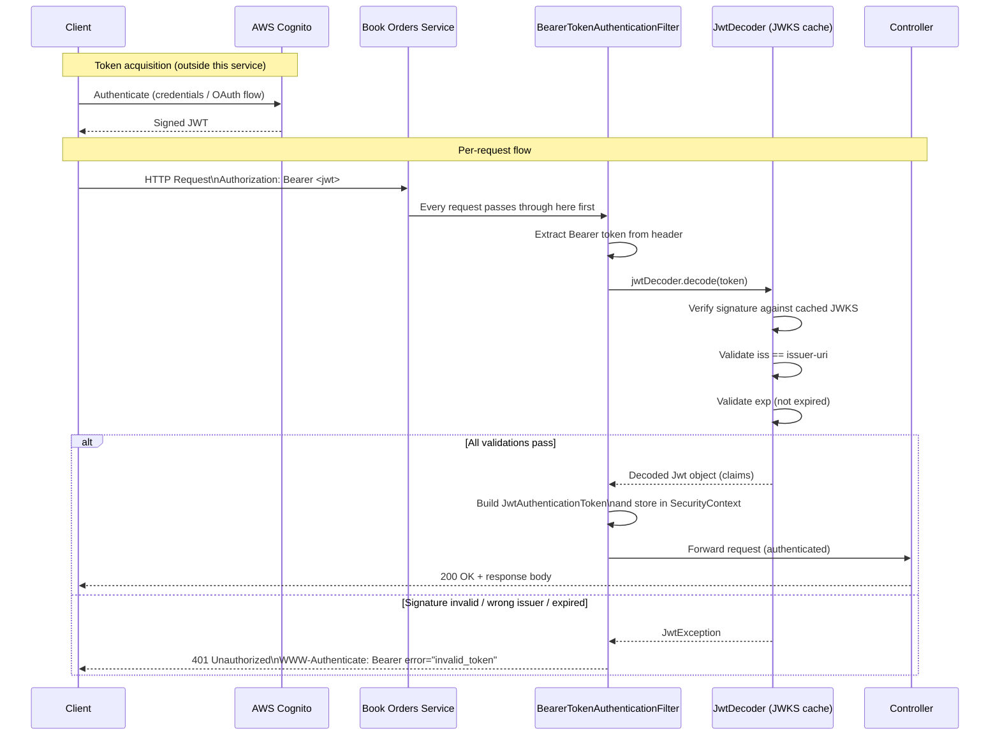
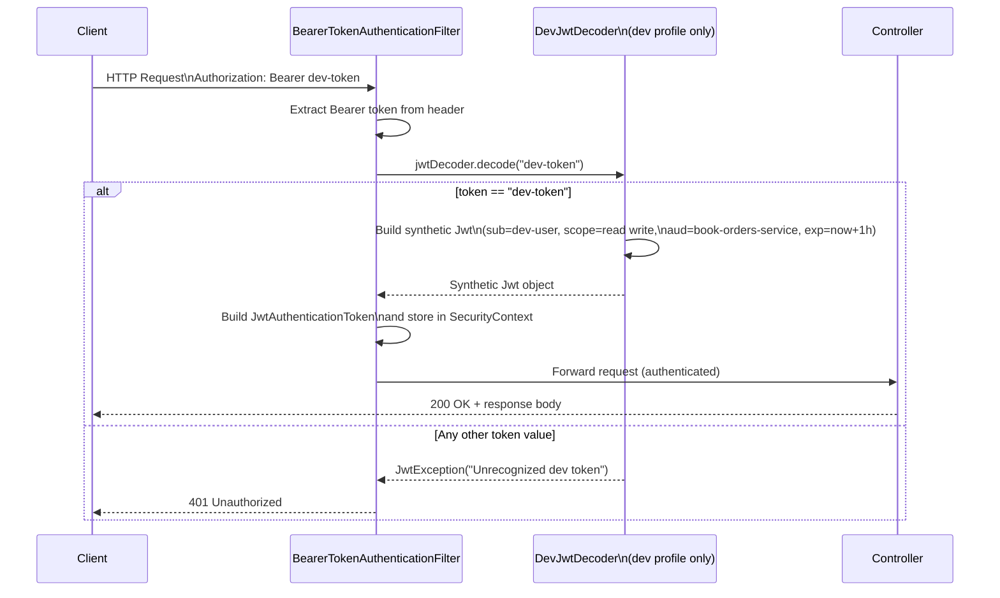

# Authentication

## Overview

The service acts as an **OAuth 2.0 Resource Server** using **JWT (JSON Web Tokens)** for authentication. All endpoints (except actuator endpoints in the `dev` profile) require a valid Bearer token in the `Authorization` header.

## Production / Default Configuration

Authentication is handled by Spring Security's OAuth 2.0 Resource Server support (`spring-boot-starter-oauth2-resource-server`). Incoming JWTs are validated against the configured issuer's public keys.

**Issuer (application.yml):**

```
https://cognito-idp.fake-region.amazonaws.com/fake-pool
```

This is configured as an **AWS Cognito** user pool. Spring Security automatically fetches the JWKS (JSON Web Key Set) from the issuer's `.well-known/jwks.json` endpoint to validate token signatures.

**Request format:**

```
Authorization: Bearer <jwt-token>
```

The `issuer-uri` can be overridden at runtime via the environment variable:

```
SPRING_SECURITY_OAUTH2_RESOURCESERVER_JWT_ISSUER_URI=<your-issuer-uri>
```

## Development Profile (`dev`)

When the application runs with the `dev` Spring profile active, two beans override the default authentication behavior:

### `DevSecurityConfig`

- Actuator endpoints (`/actuator/**`) are **permitted without authentication**, enabling easy health checks and monitoring during local development.
- All other endpoints still **require authentication**.
- CSRF protection is **disabled** for convenience in local testing.

### `DevJwtConfig`

Replaces the real `JwtDecoder` with a stub that accepts a fixed token value:

| Field           | Value                    |
| --------------- | ------------------------ |
| Token           | `dev-token`              |
| Subject (`sub`) | `dev-user`               |
| Scopes          | `read write`             |
| Audience        | `book-orders-service`    |
| Expiry          | 1 hour from request time |

**Usage:**

```
Authorization: Bearer dev-token
```

> **Warning:** `DevJwtConfig` and `DevSecurityConfig` are intentionally insecure. They must **never** be enabled in production. Both classes are annotated with `@Profile("dev")` to prevent accidental activation.

## Security Flow

### Production

The production flow involves three parties: the **client**, the **service**, and **AWS Cognito** (the identity provider).

At startup, Spring Security downloads the public key set (JWKS) from the Cognito issuer's well-known endpoint and caches it. This means no network call to Cognito happens per-request — validation is done entirely in-process using those cached keys.

When a request arrives:

1. **The client obtains a JWT from Cognito** (e.g., via the Cognito hosted UI, device flow, or client credentials grant). This happens outside this service — the service never sees user credentials, only the resulting token.
2. **The client attaches the token** to the `Authorization` header as a Bearer token.
3. **Spring Security's `BearerTokenAuthenticationFilter`** intercepts every request before it reaches any controller. It extracts the raw token string from the header.
4. **The `JwtDecoder`** (auto-configured by Spring Boot from `issuer-uri`) parses and validates the token:
   - **Signature**: the token's signature is verified against the cached Cognito public keys. This ensures the token was actually issued by Cognito and has not been tampered with.
   - **Issuer (`iss`)**: must match the configured `issuer-uri`.
   - **Expiry (`exp`)**: the token must not be expired.
5. If all checks pass, Spring Security creates an authenticated `JwtAuthenticationToken` and places it in the `SecurityContext`, making the claims (subject, scopes, etc.) available to the controller.
6. If any check fails, Spring Security short-circuits the request and returns **401 Unauthorized** — the controller is never invoked.



### Development (`dev` profile)

In the `dev` profile, the real `JwtDecoder` bean is replaced by the stub defined in `DevJwtConfig`. No network call to Cognito is ever made — instead, the decoder performs a simple string comparison against the hard-coded value `"dev-token"`.

When a request arrives:

1. **The client sends `Authorization: Bearer dev-token`** — a static, well-known string. No token acquisition step is needed.
2. **`BearerTokenAuthenticationFilter`** extracts the token string, exactly as in production.
3. **`DevJwtDecoder`** checks whether the token equals `"dev-token"`:
   - If **yes**: it constructs a synthetic `Jwt` object in memory, populating standard claims (`sub=dev-user`, `scope=read write`, `aud=book-orders-service`) with a 1-hour expiry. This object is indistinguishable from a real `Jwt` to the rest of the framework.
   - If **no**: it throws a `JwtException`, causing a 401 response.
4. Spring Security stores the synthetic `JwtAuthenticationToken` in the `SecurityContext` and the request proceeds to the controller normally.
5. Actuator endpoints (`/actuator/**`) bypass even this check — they are `permitAll()` in `DevSecurityConfig`.



> **Note on actuator endpoints (dev only):** Requests to `/actuator/**` skip the filter chain authentication check entirely — `DevSecurityConfig` marks them as `permitAll()`. No `Authorization` header is required.

## Key Files

| File                                                                                                                     | Purpose                                           |
| ------------------------------------------------------------------------------------------------------------------------ | ------------------------------------------------- |
| [src/main/resources/application.yml](../src/main/resources/application.yml)                                              | Sets the JWT issuer URI for production            |
| [src/main/java/.../config/DevSecurityConfig.java](../src/main/java/com/example/bookorders/config/DevSecurityConfig.java) | Security filter chain for the `dev` profile       |
| [src/main/java/.../config/DevJwtConfig.java](../src/main/java/com/example/bookorders/config/DevJwtConfig.java)           | Stub JWT decoder for the `dev` profile            |
| [docker-compose.yml](../docker-compose.yml)                                                                              | Overrides the issuer URI via environment variable |
