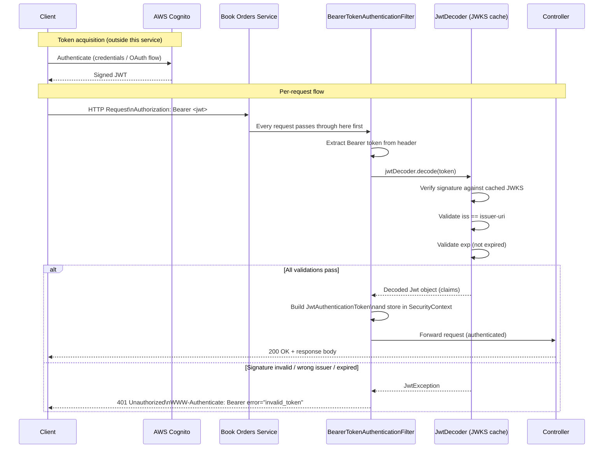
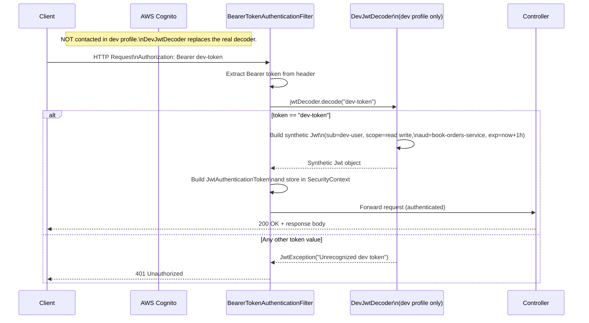

# Authentication

## Overview

- The service acts as an **OAuth 2.0 Resource Server** using **JWT (JSON Web Tokens)** for authentication. All endpoints (except actuator endpoints in the `dev` profile) require a valid Bearer token in the `Authorization` header.

---

In the OAuth 2.0 framework, there are three distinct roles:

| Role                     | Responsibility                                                                    |
| ------------------------ | --------------------------------------------------------------------------------- |
| **Authorization Server** | Issues tokens after verifying the caller's identity (AWS Cognito in this project) |
| **Resource Server**      | Hosts protected data/APIs; accepts requests only when a valid token is presented  |
| **Client**               | The application or service making requests on behalf of a user or itself          |

#### How Cognito verifies the caller's identity

It depends on the OAuth 2.0 flow being used:

- **Client Credentials** (machine-to-machine): the client sends its `client_id` and `client_secret` directly to Cognito. Cognito checks these against the app client it has registered in the user pool. There is no human user involved — the credentials are pre-provisioned in Cognito and kept secret by the calling service.

- **Authorization Code** (user-facing apps): the user enters their username and password in the Cognito hosted UI (or a federated identity provider like Google/SAML). Cognito authenticates the user against its user pool (or the federated IdP) and, upon success, issues an authorization code. The client app exchanges that code for tokens. The user's password never touches this service.

In both cases, once Cognito is satisfied with the identity, it mints a signed JWT and returns it to the caller. From that point on, this service trusts that JWT solely based on its cryptographic signature — it never re-contacts Cognito to re-verify identity per request.

**This service is a Resource Server.** It does not issue tokens or authenticate users directly — it trusts tokens that were already issued by the Authorization Server (Cognito) and uses them to decide whether to allow or deny each request.

A caller first obtains a **JWT (JSON Web Token)** from Cognito, then presents it on every request to this service as a Bearer token in the `Authorization` header. The service validates the token's signature, issuer, and expiry locally (using Cognito's public keys) without contacting Cognito on every request.

All endpoints require a valid Bearer token, except actuator endpoints (`/actuator/**`) when running under the `dev` profile.

## Production / Default Configuration

Authentication is handled by Spring Security's OAuth 2.0 Resource Server support (`spring-boot-starter-oauth2-resource-server`). Incoming JWTs are validated against the configured issuer's public keys.

**Issuer (application.yml):**

```
https://cognito-idp.fake-region.amazonaws.com/fake-pool
```

This is configured as an **AWS Cognito** user pool. Spring Security automatically fetches the JWKS (JSON Web Key Set) from the issuer's `.well-known/jwks.json` endpoint to validate token signatures.

**Request format:**

```
Authorization: Bearer <jwt-token>
```

The `issuer-uri` can be overridden at runtime via the environment variable:

```
SPRING_SECURITY_OAUTH2_RESOURCESERVER_JWT_ISSUER_URI=<your-issuer-uri>
```

## Development Profile (`dev`)

When the application runs with the `dev` Spring profile active, two beans override the default authentication behavior:

### `DevSecurityConfig`

- Actuator endpoints (`/actuator/**`) are **permitted without authentication**, enabling easy health checks and monitoring during local development.
- All other endpoints still **require authentication**.
- CSRF protection is **disabled** for convenience in local testing.

### `DevJwtConfig`

Replaces the real `JwtDecoder` with a stub that accepts a fixed token value:

| Field           | Value                    |
| --------------- | ------------------------ |
| Token           | `dev-token`              |
| Subject (`sub`) | `dev-user`               |
| Scopes          | `read write`             |
| Audience        | `book-orders-service`    |
| Expiry          | 1 hour from request time |

**Usage:**

```
Authorization: Bearer dev-token
```

> **Warning:** `DevJwtConfig` and `DevSecurityConfig` are intentionally insecure. They must **never** be enabled in production. Both classes are annotated with `@Profile("dev")` to prevent accidental activation.

## Security Flow

### Production

The production flow involves three parties: the **client**, the **service**, and **AWS Cognito** (the identity provider).

At startup, Spring Security downloads the public key set (JWKS) from the Cognito issuer's well-known endpoint and caches it. This means no network call to Cognito happens per-request — validation is done entirely in-process using those cached keys.

When a request arrives:

1. **The client obtains a JWT from Cognito** (e.g., via the Cognito hosted UI, device flow, or client credentials grant). This happens outside this service — the service never sees user credentials, only the resulting token.
2. **The client attaches the token** to the `Authorization` header as a Bearer token.
3. **Spring Security's `BearerTokenAuthenticationFilter`** intercepts every request before it reaches any controller. It extracts the raw token string from the header.
4. **The `JwtDecoder`** (auto-configured by Spring Boot from `issuer-uri`) parses and validates the token:
   - **Signature**: the token's signature is verified against the cached Cognito public keys. This ensures the token was actually issued by Cognito and has not been tampered with.
   - **Issuer (`iss`)**: must match the configured `issuer-uri`.
   - **Expiry (`exp`)**: the token must not be expired.
5. If all checks pass, Spring Security creates an authenticated `JwtAuthenticationToken` and places it in the `SecurityContext`, making the claims (subject, scopes, etc.) available to the controller.
6. If any check fails, Spring Security short-circuits the request and returns **401 Unauthorized** — the controller is never invoked.



### Development (`dev` profile)

In the `dev` profile, the real `JwtDecoder` bean is replaced by the stub defined in `DevJwtConfig`. No network call to Cognito is ever made — instead, the decoder performs a simple string comparison against the hard-coded value `"dev-token"`.

When a request arrives:

1. **The client sends `Authorization: Bearer dev-token`** — a static, well-known string. No token acquisition step is needed.
2. **`BearerTokenAuthenticationFilter`** extracts the token string, exactly as in production.
3. **`DevJwtDecoder`** checks whether the token equals `"dev-token"`:
   - If **yes**: it constructs a synthetic `Jwt` object in memory, populating standard claims (`sub=dev-user`, `scope=read write`, `aud=book-orders-service`) with a 1-hour expiry. This object is indistinguishable from a real `Jwt` to the rest of the framework.
   - If **no**: it throws a `JwtException`, causing a 401 response.
4. Spring Security stores the synthetic `JwtAuthenticationToken` in the `SecurityContext` and the request proceeds to the controller normally.
5. Actuator endpoints (`/actuator/**`) bypass even this check — they are `permitAll()` in `DevSecurityConfig`.



> **Note on actuator endpoints (dev only):** Requests to `/actuator/**` skip the filter chain authentication check entirely — `DevSecurityConfig` marks them as `permitAll()`. No `Authorization` header is required.

## Obtaining a Token

### Production (AWS Cognito)

This service only validates tokens — it never issues them. Callers must obtain a JWT from Cognito before calling any protected endpoint.

The appropriate OAuth 2.0 flow depends on the caller type:

| Caller type           | Flow                   | Description                                                                        |
| --------------------- | ---------------------- | ---------------------------------------------------------------------------------- |
| Backend service / CLI | **Client Credentials** | The client authenticates with its own credentials, no user involved                |
| User-facing app       | **Authorization Code** | User logs in via the Cognito hosted UI; the app exchanges the auth code for tokens |

#### Client Credentials (machine-to-machine)

```bash
curl -X POST \
  https://your-domain.auth.<region>.amazoncognito.com/oauth2/token \
  -H "Content-Type: application/x-www-form-urlencoded" \
  -d "grant_type=client_credentials\
&client_id=<your-client-id>\
&client_secret=<your-client-secret>\
&scope=<your-scope>"
```

The response contains the `access_token` (a signed JWT), which is then passed to this service:

```bash
curl -H "Authorization: Bearer <access_token>" \
  http://localhost:8080/orders
```

Token lifetime and rotation are managed entirely by Cognito. When the token expires, repeat the request to Cognito to obtain a fresh one.

#### Authorization Code (user-facing apps)

1. Redirect the user to the Cognito hosted UI login page.
2. After login, Cognito redirects back to your configured `redirect_uri` with a `code` query parameter.
3. Exchange the code for tokens:

```bash
curl -X POST \
  https://your-domain.auth.<region>.amazoncognito.com/oauth2/token \
  -H "Content-Type: application/x-www-form-urlencoded" \
  -d "grant_type=authorization_code\
&client_id=<your-client-id>\
&code=<authorization-code>\
&redirect_uri=<your-redirect-uri>"
```

Use the returned `access_token` (or `id_token` depending on your configuration) as the Bearer token.

### Development (`dev` profile)

No Cognito interaction is needed. Use the fixed token `dev-token` directly:

```bash
curl -H "Authorization: Bearer dev-token" \
  http://localhost:8080/orders
```

The [Postman collection](../postman/book-orders.postman_collection.json) pre-configures this via the `{{devToken}}` environment variable, which is set to `dev-token` in [postman/book-orders.postman_environment.json](../postman/book-orders.postman_environment.json).

## Key Files

| File                                                                                                                     | Purpose                                           |
| ------------------------------------------------------------------------------------------------------------------------ | ------------------------------------------------- |
| [src/main/resources/application.yml](../src/main/resources/application.yml)                                              | Sets the JWT issuer URI for production            |
| [src/main/java/.../config/DevSecurityConfig.java](../src/main/java/com/example/bookorders/config/DevSecurityConfig.java) | Security filter chain for the `dev` profile       |
| [src/main/java/.../config/DevJwtConfig.java](../src/main/java/com/example/bookorders/config/DevJwtConfig.java)           | Stub JWT decoder for the `dev` profile            |
| [docker-compose.yml](../docker-compose.yml)                                                                              | Overrides the issuer URI via environment variable |
